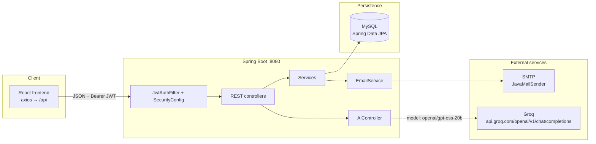

<p align="center">
  
  
  
  
</p>

<h1 align="center">Mock Evaluation System — Backend</h1>

<p align="center">
  <strong>Spring Boot REST API</strong> for the FirstBit Solutions mock evaluation portal.<br />
  Manages users, batches, students, evaluations, analytics, email, and Groq-backed AI generation.
</p>

<p align="center">
  <a href="https://github.com/ranjitgithub2001/fbs-mock-evaluation-backend-new"></a>
  <a href="https://github.com/ranjitgithub2001/fbs-mock-evaluation-frontend-new"></a>
  
</p>

---

## Table of contents

- [About](#about)
- [Features](#features)
- [Architecture](#architecture)
- [Technology stack](#technology-stack)
- [Project structure](#project-structure)
- [Prerequisites](#prerequisites)
- [Local setup](#local-setup)
- [Configuration](#configuration)
- [API overview](#api-overview)
- [Security notes](#security-notes)
- [Tests](#tests)
- [Related repository](#related-repository)

---

## About

This service is the API for an internal training portal. Trainers record mock evaluations against students in a batch, admins manage users and academic data, and placement staff can read evaluation and analytics endpoints that Spring Security allows for that role.

The companion UI lives in **[fbs-mock-evaluation-frontend-new](https://github.com/ranjitgithub2001/fbs-mock-evaluation-frontend-new)**. This repository is the backend only.

---

## Features

| Area | What the code does |
| --- | --- |
| **Auth** | Password login for all roles. OTP login for `TRAINER` and `PLACEMENT`. Forgot-password OTP + reset. JWT (`Authorization: Bearer`) on protected routes. |
| **Trainer onboarding** | Public `POST /api/trainer-requests`. Admins list, approve, or reject. Approval creates a user and emails a password-setup OTP. |
| **Academic data** | CRUD for batches, course modules, students (including bulk create and lookup by FRN), and batch–module assignments. |
| **Evaluations** | Create, update, filter, delete. Scores 0–5 (technical, confidence, communication). Results: `CLEARED`, `NOT_CLEARED`, `ABSENT`, `RESCHEDULED`. Stage suggestion for `PRACTICE` / `END_MODULE`. |
| **Analytics** | Batch overview and progress, student performance, module performance, trainer performance. |
| **AI** | `POST /api/ai/generate` calls Groq Chat Completions (`openai/gpt-oss-20b`). Returns **503** if `groq.api.key` is blank; otherwise forwards Groq’s HTTP status and body. |
| **Email** | SMTP via Spring Mail: login/reset OTPs, trainer approve/reject, student evaluation reports. |
| **Access control** | Role-based matchers in `SecurityConfig` (`ADMIN`, `TRAINER`, `PLACEMENT`). Passwords stored with BCrypt. |
| **Abuse limits** | In-memory rate limit on trainer registration (3 attempts per email per hour). OTP: 10-minute TTL, 60-second resend cooldown, 5 failed verifies. |

`UserRole` also includes `OFFICE_STAFF` and `VIEWER`. Those values exist on the entity; this API does not expose dedicated portals for them.

---

## Architecture

Confirmed by the current controllers, `EmailService`, `AiController`, and JPA entities:



CORS in `SecurityConfig` currently allows `http://localhost:3000` and `https://shubhamwagh.co.in` (credentials enabled). CSRF is disabled because sessions are stateless.

---

## Technology stack

| Layer | Choice (from `pom.xml` / source) |
| --- | --- |
| Runtime | Java 17 |
| Framework | Spring Boot **4.0.2** (`spring-boot-starter-webmvc`) |
| Security | Spring Security, JJWT **0.11.5**, BCrypt |
| Persistence | Spring Data JPA, MySQL Connector/J |
| Validation | `spring-boot-starter-validation` |
| Mail | `spring-boot-starter-mail` |
| AI HTTP | Java `HttpClient` → Groq OpenAI-compatible API |
| Build | Maven Wrapper (`./mvnw`) |
| Utilities | Lombok |

---

## Project structure

```text
.
├── Dockerfile
├── pom.xml
├── mvnw / mvnw.cmd
├── src/main/java/com/fbs/mock_evaluation_system/
│   ├── MockEvaluationSystemApplication.java
│   ├── controller/     # REST endpoints under /api/**
│   ├── dto/
│   ├── entity/         # User, Student, Batch, Evaluation, …
│   ├── exception/      # GlobalExceptionHandler, 429, validation
│   ├── mapper/
│   ├── repository/
│   ├── security/       # JWT filter, SecurityConfig, rate limiter
│   ├── service/        # Auth, evaluations, email, reports, …
│   ├── specification/
│   └── util/           # FRN helpers
├── src/main/resources/
│   ├── application.properties.example   # local template (commit this)
│   └── application-prod.properties      # env-var based profile
└── src/test/java/                       # focused unit tests
```

`src/main/resources/application.properties` is **gitignored**. Do not commit it.

---

## Prerequisites

- **JDK 17**
- **Maven 3.9+** or the included wrapper (`./mvnw`)
- **MySQL** with a database you control
- SMTP credentials if you want OTP / report email
- A Groq API key only if you want `/api/ai/generate` (otherwise that endpoint returns 503)

---

## Local setup

1. Clone this repository.
2. Copy the example config (never commit the copy):

   ```bash
   cp src/main/resources/application.properties.example \
      src/main/resources/application.properties
   ```

3. Edit the copy with **placeholders replaced by your local values**. See [Configuration](#configuration).
4. Create the MySQL database named in `spring.datasource.url`.
5. Ensure `mock_stage` rows named `PRACTICE` and `END_MODULE` exist. `EvaluationService` looks up those names when suggesting the next stage.
6. Build and run (default port **8080**):

   ```bash
   ./mvnw test
   ./mvnw -DskipTests package
   java -jar target/mock-evaluation-system-0.0.1-SNAPSHOT.jar
   ```

   Or:

   ```bash
   ./mvnw spring-boot:run
   ```

Do **not** start with `--spring.profiles.active=prod` unless you have set the environment variables that `application-prod.properties` expects. The `Dockerfile` in this repo activates `prod` by default.

---

## Configuration

Use placeholders only. Real passwords, JWT secrets, and API keys belong in the gitignored local file or the server sidecar — never in git.

`JwtUtil` binds **`jwt.secret`** and **`jwt.expiration`** (not `app.jwt.*`). A working local file looks like this:

```properties
# Database
spring.datasource.url=jdbc:mysql://localhost:3306/your_db_name
spring.datasource.username=your_db_username
spring.datasource.password=your_db_password
spring.datasource.driver-class-name=com.mysql.cj.jdbc.Driver
spring.jpa.hibernate.ddl-auto=update
spring.jpa.show-sql=false

# Mail (Spring JavaMailSender)
spring.mail.host=smtp.gmail.com
spring.mail.port=587
spring.mail.username=your_email@example.com
spring.mail.password=your_smtp_app_password
spring.mail.properties.mail.smtp.auth=true
spring.mail.properties.mail.smtp.starttls.enable=true
app.mail.from=your_email@example.com

# JWT — keys read by JwtUtil
jwt.secret=your_jwt_secret_key_min_32_chars
jwt.expiration=86400000

# Groq AI (optional locally; blank → HTTP 503 on /api/ai/generate)
groq.api.key=your_groq_api_key_here

# Server
server.port=8080
```

| Property | Used for |
| --- | --- |
| `spring.datasource.*` | MySQL connection |
| `spring.mail.*` / `app.mail.from` | OTP, trainer emails, student reports |
| `jwt.secret` / `jwt.expiration` | HS256 JWT (expiration is milliseconds; example is 24h) |
| `groq.api.key` | Bearer token to Groq |

---

## API overview

Base path: **`/api`**. Send JSON. Protected routes need:

```http
Authorization: Bearer <jwt>
```

### Public

| Method | Path | Purpose |
| --- | --- | --- |
| `POST` | `/api/auth/login` | Password login → JWT |
| `POST` | `/api/auth/otp/send` | Login OTP for `TRAINER` / `PLACEMENT` (generic response) |
| `POST` | `/api/auth/otp/verify` | Verify login OTP → JWT |
| `POST` | `/api/auth/forgot-password` | Reset OTP (generic response) |
| `POST` | `/api/auth/verify-otp` | Check reset OTP |
| `POST` | `/api/auth/reset-password` | Set new password |
| `POST` | `/api/trainer-requests` | Public trainer registration |

### Admin

| Method | Path | Purpose |
| --- | --- | --- |
| `GET` / `POST` `…/approve` / `…/reject` | `/api/trainer-requests` | Review onboarding |
| `GET` `POST` `PUT` `PATCH` | `/api/users` | Users, activate/deactivate, change password |
| `POST` `PUT` `DELETE` | `/api/batches`, `/api/modules`, `/api/students`, `/api/batch-modules` | Academic admin |
| `DELETE` | `/api/evaluations/{id}` | Delete evaluation (`DELETE /**` is admin-only) |

### Admin + trainer

| Method | Path | Purpose |
| --- | --- | --- |
| `GET` | `/api/students`, `/api/batches`, `/api/modules`, `/api/batch-modules` | Read academic data |
| `GET` | `/api/students/by-frn?frn=` | Lookup by FRN |
| `POST` `PUT` | `/api/evaluations` | Create / update mocks |
| `GET` | `/api/evaluations/suggest-stage` | Next `PRACTICE` / `END_MODULE` |
| `POST` | `/api/ai/generate` | Groq completion |
| `POST` | `/api/reports/student/email` | Email student report (`studentId`, `recipientEmail`, `aiSummary`) |

### Admin + trainer + placement

| Method | Path | Purpose |
| --- | --- | --- |
| `GET` | `/api/evaluations` | Paged list with filters (`studentId`, `batchModuleId`, `trainerId`, `mockStageId`, `finalResult`, date range). Page size capped at 50. |
| `GET` | `/api/evaluations/student/{studentId}` | Evaluations for one student |
| `GET` | `/api/evaluations/batch-module/{batchModuleId}` | Evaluations for a batch module |
| `GET` | `/api/analytics/batch/{batchId}/overview` | Batch overview |
| `GET` | `/api/analytics/batch/{batchId}/progress` | Batch progress |
| `GET` | `/api/analytics/student/{studentId}/performance` | Student performance |
| `GET` | `/api/analytics/modules/performance` | Module performance |
| `GET` | `/api/analytics/trainers/performance` | Trainer performance |

Login OTP send/verify always return generic messages so callers cannot probe whether an email exists.

---

## Security notes

> **Never commit secrets.** `.gitignore` excludes `src/main/resources/application.properties`, `.env`, and `.env.*`. JWT secrets, DB passwords, SMTP passwords, and `groq.api.key` must stay out of git.

- Passwords are hashed with **BCrypt** (`SecurityConfig`).
- OTP values are stored **in memory** (not in MySQL) and expire after 10 minutes.
- Trainer registration is rate-limited **in memory** (resets on process restart).
- Production credentials belong in environment variables or a server-side sidecar file, not in this repository.
- Do not paste real API keys, JWTs, or passwords into issues, READMEs, or screenshots.

---

## Tests

```bash
./mvnw test
```

Focused tests live under `src/test/java` (OTP, forgot-password, JWT filter, rate limiter, trainer-request approve/reject, Groq status mapping).

---

## Related repository

| Piece | Repository |
| --- | --- |
| Frontend (React) | [fbs-mock-evaluation-frontend-new](https://github.com/ranjitgithub2001/fbs-mock-evaluation-frontend-new) |
| This API | [fbs-mock-evaluation-backend-new](https://github.com/ranjitgithub2001/fbs-mock-evaluation-backend-new) |

Point the frontend `REACT_APP_API_BASE_URL` at this service (local default `http://localhost:8080`). The UI appends `/api` itself.

### Screenshots

This is an API repository, so there are no UI screenshots here. For portal captures, see the frontend README’s suggested `docs/screenshots/` locations.
